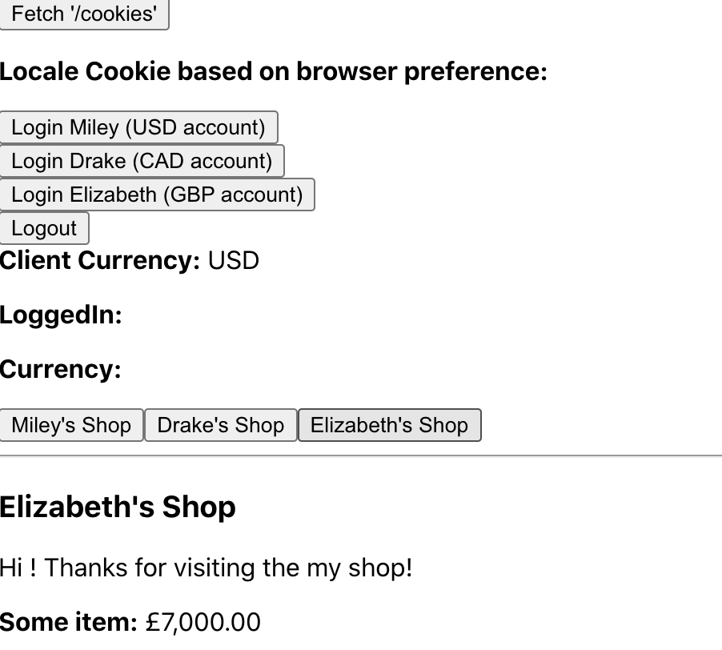

# Currency Internationalization

This is a sample project that shows how to set the currency for a user depending on their language preference in their browser `accept-language` header.

Right now this project:

- shows how to detect and set the locale in the cookie.
- Can (insecurely) login/logout aka create a user on the session.
- Browse different users shops.
- Set the currency cookie based on `accept-language` header or ask the user their preference if not clear from `accept-language`.
- detects currency by user settings or by cookie
- shop displays correct currency
- More to come...



Resources: [React Internationalization – How To](https://www.smashingmagazine.com/2017/01/internationalizing-react-apps/)

## Proxy

I added a proxy to this create react app project. A proxy allows you to act as if your frontend and backend servers are running on the same server. This allows you to bypass cors. This proxy only works for development. In production, you have to run your front and backend on the same server or set up cors.

1. Add `webpack.config.js`
2. `"proxy": "http://localhost:4000"`

## `Accept-Header` Values explained

**Example Value:** `da,en-GB;q=0.8,en;q=0.7`

This value says the browser's preference is `da` which is the language code for Danish, but will accept British English, and then other types of English.

The values following the language codes, like `;q=0.7`, go from 0 to 1. 1 means it is the most preferred language. If there is no value following a language code the value defaults to 1. So `da` is the same as `da;q=1`.

## Testing Different Language Headers

### How to Change Language Header in Postman

If you want to test the backend server with different languages you can do this with postman. Go the `Headers` tab and add `accept-language` in the key field and some value.


### How to Change Language Headers in Your browser

Lots of suggestions here:

- [How to change the locale in chrome browser](https://stackoverflow.com/questions/37221494/how-to-change-the-locale-in-chrome-browser)

### What I did

1. navigate to `chrome://settings/languages`.
2. Book marked the page for easy return.
3. Edit this panel:
4.

### How to Change Language Headers in your frontend code

```javascript
const headers = new Headers();
headers.set('Accept-Language', 'fr-CA;q=1.0');
fetch('/cookies', { credentials: 'same-origin', headers })
  .then((r) => {
    return r.text();
  })
  .then((text) => {
    setDisplayText(text);
    console.log(`proxy request: ${text}`);
  })
  .catch((err) => {
    console.log(`proxy request: ${err}`);
  });
```


Resources: [React Internationalization – How To](https://www.smashingmagazine.com/2017/01/internationalizing-react-apps/)

## Detecting the preferred locale from the header

This function extracts the preferred local from `req.headers['accept-language']`. It picks the highest weighted locale that has a country code, unless the there is a higher locale that doesn't have a country code. If none have a country code, it first the highest weighted locale.

If we have `en,en-CA;q=0.8` it would result in `en-CA` as the preference.

```javascript
const getPreferredLocale = (acceptLanguageHeader) => {
  const locales = acceptLanguageHeader
    .split(/(\b, \b|\b,\b|\b;q=\b)/g)
    .filter((el) => el !== ',' && el !== ', ' && el !== ';q=')
    .reduce(
      (a, c, i, arr) =>
        Number.isNaN(Number(c))
          ? [...a, { locale: c, q: Number.isNaN(Number(arr[i + 1])) ? '1' : arr[i + 1] }]
          : a,
      []
    )
    .sort((a, b) => (a.q > b.q ? -1 : 1));
  return (prefLocale =
    locales.find((el) => el.locale.match(/-[A-Z]{2}/g))?.locale || locales[0].locale);
};
```

### No Country Code in Header?

Country code is important for currency. So what if the preferred locale is a language code without a country? Then we can either:

1. Guess the country
2. Ask the user their preferred currency
3. Ping this api from the client to get the country code:

```javascript
const countryCode = await fetch('https://extreme-ip-lookup.com/json/')
  .then((res) => res.json())
  .then((response) => {
    return response.countryCode;
  })
  .catch(() => {
    console.log('Request failed');
  });
```

Give the user an option to change their locale or currency as well.

## Read Cookies on frontend

If we want to access the cookies on the front end, we can now do so.

### Not readable

```javascript
document.cookie;

//> "locale=%7B%22locale%22%3A%22en-CA%22%2C%22countryCode%22%3A%22CA%22%2C%22languageCode%22%3A%22en%22%7D othercookie=somevalue"
```

### All cookies in a readable format

```javascript
decodeURIComponent(document.cookie);

//> ""locale={"locale":"en-CA","countryCode":"CA","languageCode":"en"}; othercookie=somevalue""
```

### JSON of the "locale" cookie only

```javascript
JSON.parse(
  decodeURIComponent(document.cookie).match(/((?<=locale=)(.*)(?=;))|((?<=locale=)(.*)(?=))/)[0]
);

//> {locale: "en-CA", countryCode: "CA", languageCode: "en"}
```

### Parsed Cookies function

Returns an object with each cookie as key value pair.

```javascript
const parsedCookies = () => {
  const str = decodeURIComponent(document.cookie).split('; ');
  const result = {};
  for (let i = 0; i < str.length; i++) {
    const cur = str[i].split('=');
    result[cur[0]] = cur[1];
  }
  return result;
};
```

##

<hr>

Notes for later:

<hr>

## Country Data

`npm i country-data`

[Country Data](https://www.npmjs.com/package/country-data)

## Setting cookies across domains when in production

[Creating a JavaScript cookie on a domain and reading it across sub domains](https://stackoverflow.com/questions/5671451/creating-a-javascript-cookie-on-a-domain-and-reading-it-across-sub-domains)

> ```html
> <script type="text/javascript">
>   var cookieName = 'HelloWorld';
>   var cookieValue = 'HelloWorld';
>   var myDate = new Date();
>   myDate.setMonth(myDate.getMonth() + 12);
>   document.cookie =
>     cookieName + '=' + cookieValue + ';expires=' + myDate + ';domain=.example.com;path=/';
> </script>
> ```

People in the comments said this was difficult to do when texting on localhost:

> Browsers treat localhost cookies a bit differently than other cookies. Or rather, they treat all cookies in a way that makes working with localhost difficult. For instance, see stackoverflow.com/questions/1134290/…. I suggest editing your hosts file and aliasing something like myserver.local to 127.0.0.1. Then you can use that to access your local server (and when setting cookies), and hopefully everything should work.

Also:

> I would suggest is using the global encodeURI() & decodeURI() methods for the cookie name & value to handle any conversion that would need to take place. i.e. document.cookie = encodeURI(cookieName) +"=" + encodeURI(cookieValue).
